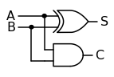

---
redirect_from:
  - "matematicas/algebra/30-funciones-logicas"
interact_link: content/matematicas/algebra/30_funciones_logicas.ipynb
kernel_name: python3
has_widgets: false
title: 'Funciones lógicas'
prev_page:
  url: /matematicas/algebra/20_conjuntos_completos.html
  title: 'Conjuntos completos de operadores lógicos'
next_page:
  url: /matematicas/algebra/40_expansiones_canonicas.html
  title: 'Expansiones canónicas'
comment: "***PROGRAMMATICALLY GENERATED, DO NOT EDIT. SEE ORIGINAL FILES IN /content***"
---
# **Funciones lógicas**


## Tablas de verdad


<div markdown="1" class="cell code_cell">
<div class="input_area hidecode" markdown="1">
```python
import pandas as pd

tt = pd.DataFrame(columns=['A','B','F(A,B)'], data=[[0,0,0],[0,1,1],[1,0,1],[1,1,0]])
tt

```
</div>

<div class="output_wrapper" markdown="1">
<div class="output_subarea" markdown="1">


<div markdown="0" class="output output_html">
<div>
<style scoped>
    .dataframe tbody tr th:only-of-type {
        vertical-align: middle;
    }

    .dataframe tbody tr th {
        vertical-align: top;
    }

    .dataframe thead th {
        text-align: right;
    }
</style>
<table border="1" class="dataframe">
  <thead>
    <tr style="text-align: right;">
      <th></th>
      <th>A</th>
      <th>B</th>
      <th>F(A,B)</th>
    </tr>
  </thead>
  <tbody>
    <tr>
      <th>0</th>
      <td>0</td>
      <td>0</td>
      <td>0</td>
    </tr>
    <tr>
      <th>1</th>
      <td>0</td>
      <td>1</td>
      <td>1</td>
    </tr>
    <tr>
      <th>2</th>
      <td>1</td>
      <td>0</td>
      <td>1</td>
    </tr>
    <tr>
      <th>3</th>
      <td>1</td>
      <td>1</td>
      <td>0</td>
    </tr>
  </tbody>
</table>
</div>
</div>


</div>
</div>
</div>


## Diagramas lógicos


<div markdown="1" class="cell code_cell">
<div class="input_area" markdown="1">
```python
import SchemDraw as schem
import SchemDraw.logic as l
import SchemDraw.elements as e

d = schem.Drawing(unit=.5)
S = d.add(l.XOR2, rgtlabel='$S$')
A = d.add(e.DOT, xy=S.in1)
d.add(e.LINE, d='left', l=d.unit*2, lftlabel='$A$')
d.add(e.LINE, d='left', xy=S.in2)
B = d.add(e.DOT)
d.add(e.LINE, d='left', lftlabel='$B$')
d.add(e.LINE, d='down', xy=A.start, l=d.unit*3)
C = d.add(l.AND2, d='right', anchor='in1', rgtlabel='$C$')
d.add(e.LINE, d='down', xy=B.start, toy=C.in2)
d.add(e.LINE, to=C.in2)
d.draw()

```
</div>

<div class="output_wrapper" markdown="1">
<div class="output_subarea" markdown="1">

{:.output_png}


</div>
</div>
</div>


## Minitérminos, maxitérminos y pitérminos

