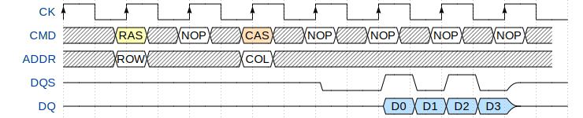
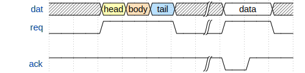

---
redirect_from:
  - "matematicas/automatas/20-estado-transiciones"
interact_link: content/matematicas/automatas/20_estado_transiciones.ipynb
kernel_name: python3
has_widgets: false
title: 'Estado de un sistema discreto'
prev_page:
  url: /matematicas/automatas/10_sistemas_discretos.html
  title: 'Sistemas discretos'
next_page:
  url: /matematicas/automatas/30_dte.html
  title: 'Diagramas de transición de estado'
comment: "***PROGRAMMATICALLY GENERATED, DO NOT EDIT. SEE ORIGINAL FILES IN /content***"
---
# **Estado de un sistema discreto**


## Estados


## Transiciones


## Diagramas de tiempo


<div markdown="1" class="cell code_cell">
<div class="input_area hidecode" markdown="1">
```python
import wavedrom
svg = wavedrom.render("""{ "signal": [
{ "name": "CK",   "wave": "P.......",                                              "period": 2  },
{ "name": "CMD",  "wave": "x.3x=x4x=x=x=x=x", "data": "RAS NOP CAS NOP NOP NOP NOP", "phase": 0.5 },
{ "name": "ADDR", "wave": "x.=x..=x........", "data": "ROW COL",                     "phase": 0.5 },
{ "name": "DQS",  "wave": "z.......0.1010z." },
{ "name": "DQ",   "wave": "z.........5555z.", "data": "D0 D1 D2 D3" }]}""")
svg.saveas("demo1.png")

```
</div>

</div>





<div markdown="1" class="cell code_cell">
<div class="input_area hidecode" markdown="1">
```python
svg = wavedrom.render("""{ "signal": [
{"name": "dat", "wave": "x.345x|=.x", "data": ["head", "body", "tail", "data"]},
{"name": "req", "wave": "0.1..0|1.0"},
{},
{"name": "ack", "wave": "1.....|01."}]}""")
svg.saveas("demo2.svg")

```
</div>

</div>




