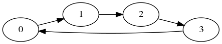
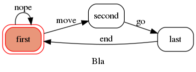

---
redirect_from:
  - "matematicas/automatas/30-dte"
interact_link: content/matematicas/automatas/30_dte.ipynb
kernel_name: python3
has_widgets: false
title: 'Diagramas de transición de estado'
prev_page:
  url: /matematicas/automatas/20_estado_transiciones.html
  title: 'Estado de un sistema discreto'
next_page:
  url: /matematicas/automatas/40_asm.html
  title: 'Máquina de estado algorítmica'
comment: "***PROGRAMMATICALLY GENERATED, DO NOT EDIT. SEE ORIGINAL FILES IN /content***"
---
# **Diagramas de transición de estado**


<div markdown="1" class="cell code_cell">
<div class="input_area hidecode" markdown="1">
```python
import networkx as nx
from nxpd import draw
G = nx.cycle_graph(4, create_using=nx.DiGraph())
G.graph['rankdir'] = 'LR'
draw(G, show='ipynb')

```
</div>

<div class="output_wrapper" markdown="1">
<div class="output_subarea" markdown="1">


{:.output_png}



</div>
</div>
</div>


<div markdown="1" class="cell code_cell">
<div class="input_area hidecode" markdown="1">
```python
from transitions.extensions import GraphMachine

states = ['first', 'second', 'last']
transitions = [
    {'trigger': 'move', 'source': 'first', 'dest': 'second'},
    {'trigger': 'go', 'source': 'second', 'dest': 'last'},
    {'trigger': 'end', 'source': 'last', 'dest': 'first'},
    {'trigger': 'nope', 'source': 'first', 'dest': 'first'},
]

```
</div>

</div>


<div markdown="1" class="cell code_cell">
<div class="input_area hidecode" markdown="1">
```python
class Basic(object): pass

machine = GraphMachine(model=Basic,
                       states=states,
                       transitions=transitions,
                       initial='first',
                       auto_transitions=False,
                       show_conditions=True,
                       title='Bla'
                       )
machine.get_graph().draw('./fsm.png', prog='dot')

```
</div>

</div>




